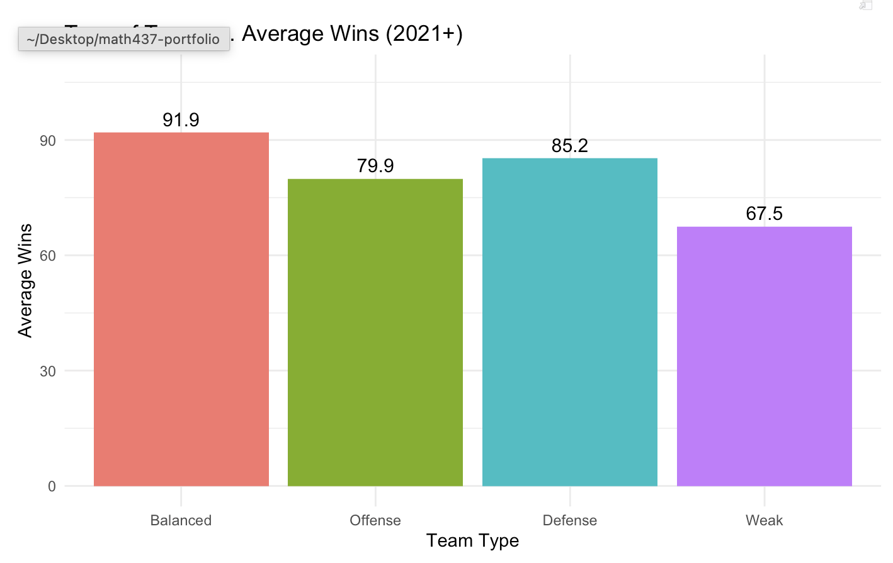

## Summary

In this project, I decided to look into the effects of some of the main offensive and defensive statistics on wins for MLB teams. I was mostly curious on how earned run average and batting average affected the number of wins, then expanded from there. Overall, I discovered that more balanced teams won games than more offensive-based or more defensive-based.



The data was sorted into different team types using the median ERA and mean batting average as indicators of good versus bad at defense and offense. ERA was chosen because pitching is a main factor to defensive strength, and batting average is a fantastic indicator of offensive skill. Balanced teams won about 6 games more than defensive-heavy teams and 12 games more than offensive-heavy teams. There is a significant difference between balanced and weak teams. If a team wants to win more games, they should focus on having a balanced team, but if that is not possible, defensive-heavy teams seem to be the next best option.

## Motivation and Context

```{r}
#| label: do this first
#| echo: false
#| message: false

here::i_am("Offensive-Defensive.qmd")
```

Baseball is one of the most statistics-heavy sports in the world. Millions of pieces of data are collected within a single game. In recent years, records have been broken for the most games won in a season, so I was curious to see what kind of teams win the most and what aspect of baseball is the most important: offense or defense. When discussing the difference between the two, I consider a team being on the field with a pitcher throwing (defensive) versus hitting at the plate (offensive). Two of the most important statistics for team are the earned run average (ERA) and the batting average. Each player has their own statistic for these, but in this project, we are only considering the team average throughout the season.

## Packages Used In This Analysis

This section lists the packages used in the analysis. You should have a single chunk that loads the packages followed by a description of why you are using each package. Please use individual package names rather than tidyverse and tidymodels, to make it clear which specific packages are being used.

```{r}
#| label: load packages
#| message: false
#| warning: false

library(here)
library(readr)
library(dplyr)
library(rsample)
library(ggplot2)
library(baseballr)
library(Lahman)
library(tibble)
library(recipes)
library(parsnip) 
library(workflows)
library(tune)
library(yardstick)
library(broom)
library(kknn)
```

| Package | Use |
|--------------------------------|----------------------------------------|
| [here](https://github.com/jennybc/here_here) | to easily load and save data |
| [readr](https://readr.tidyverse.org/) | to import the CSV file data |
| [dplyr](https://dplyr.tidyverse.org/) | to massage and summarize data |
| [rsample](https://rsample.tidymodels.org/) | to split data into training and test sets |
| [ggplot2](https://ggplot2.tidyverse.org/) | to create nice-looking and informative graphs |
| [baseballr](https://cran.r-project.org/web/packages/baseballr/index.html) | baseball data access tools |
| [Lahman](https://cran.r-project.org/web/packages/Lahman/index.html) | Historical MLB team statistics database |
| [tibble](https://cran.r-project.org/web/packages/tibble/index.html) | to create tidy data frames |
| [recipes](https://cran.r-project.org/web/packages/recipes/index.html) | to preprocess and normalize data |
| [parsnip](https://cran.r-project.org/web/packages/parsnip/index.html) | to specify models |
| [workflows](https://cran.r-project.org/web/packages/workflows/index.html) | to combine recipes and models |
| [tune](https://cran.r-project.org/web/packages/tune/index.html) | to tune hyperparameters |
| [yardstick](https://cran.r-project.org/web/packages/yardstick/index.html) | to find model performance metrics |
| [broom](https://cran.r-project.org/web/packages/broom/index.html) | to tidy the model outputs |
| [kknn](https://cran.r-project.org/web/packages/kknn/index.html) | KNN algorithm engine |

## Data Description

The Society for American Baseball Research member Sean Lahman collected this data and it is updated after each season. Data is collected up to the 2025 season as recorded in the 2026 version of the database. The data was collected in order to allow people to conduct research projects and simulate games.

Link to website: <https://sabr.org/lahman-database/>

The data can be found within the Lahman package in R.

## Data Wrangling (Optional Section)

If you did any data wrangling on Project 2, include it here. If you are creating training and test sets for predictive modeling, you should also include that code in an appropriate place in this section.

```{r}
#| label: data wrangling
teams <- Teams
teams <- teams |>
  filter(
    yearID >= 2021
  ) # filters to only teams 2021-2025

teams <- teams |> 
  select(
  yearID, # year played
  name, # name of team
  W, # wins 
  G, # games - 161-162 depending on the season 
  R, # runs 
  AB, # at bats
  H, # hits
  X2B, # doubles
  X3B, # triples
  HR, # home runs
  BB, # walk
  SO, # strikeout
  SB, # stolen base
  CS, # caught stealing
  HBP, # hit by pitch
  SF, # sacrifice fly
  RA, # opponents runs scored
  ER, # earned runs 
  ERA, # earned run average
  SHO, # shutouts
  SV, # saves 
  IPouts, # outs pitched 
  HA, # hits allowed
  HRA, # homeruns allowed
  BBA, # walks allowed
  E, # errors
  DP # double plays
  )
teams <- teams |>
  mutate(
    WinPct = round(W/G, 4), # win percentage
    run_diff = R-RA, # run differential 
    WHIP = round((BBA + HA)/(IPouts/3), 2), # WHIP -> walks, hits per inning pitched
    AVG = round(H/AB, 3), # batting average
    OBP = round((H+BB+HBP)/(AB+BB+HBP+SF), 3), # on-base percentage 
    slugpct = round(((H-X2B-X3B-HR) + 2*X2B + 3*X3B + 4*HR) / AB, 3), # slugging percentage
    OPS = round(OBP + slugpct, 4) # OPS
  )
```

```{r}
#| label: split into train and test data
set.seed(2026)
teams_split <- initial_split(teams, prop = .8)
teams_train <- training(teams_split)
teams_test <- testing(teams_split)
```

The data set was split into 80% and 20% of the data, where 80% went into the training set and 20% went into the test set. The training set has 120 observations and the testing set has 30 observations.

## Exploratory Data Analysis

I decided to look into some big indicators of success within a baseball team: batting average and earned run average. Batting average is often a great indicator of success from offense and earned run averages are an indicator of defense. This will help me to categorize the groupings of offensive versus defensive teams.

```{r}
#| label: Boxplot of ERA (2021+)

ggplot(teams, aes(x = ERA)) + 
  geom_histogram(binwidth = 0.20) +
  labs(
    title = "Histogram of Earned Run Average", 
    x = "Earned Run Average"
  )
summary(teams$ERA)
```

The average earned run average for the 5 years and 30 teams was around 4.16, meaning the pitchers allowed about 4.16 runs per 9 innings. This is a great indicator of how batting measures up against pitching. Higher ERAs indicate weaker pitching performance. Teams with a higher ERA might be categorized as having better batting, or just are bad in general.

```{r}
#| label: Histogram of Team Batting Average (2021+)

ggplot(
  teams,
  aes(x = AVG)) + 
  geom_histogram(binwidth = 0.005) + 
  labs(
    title = "Distribution of Team Batting Average (2021+)",
    x = "Batting Average",
    y = "Count"
  )

summary(teams$AVG)
```

The mean batting average of the 30 teams over the 5 years was 0.245, meaning that in all, MLB players and teams got a hit 24.5% of the time when they went up to the plate. In context, teams want to aim to be at least at this average in order to be successful. Individual players that are better than this average are considered to be better. The highest average was 0.2760.

Continuing on with my exploration of the data, some great comparisons for team performance would be both of the previous variables with the winning percentage to compare how each contributed to the success of the teams.

```{r}
#| label: Batting Average vs Winning Percentage

ggplot(
  teams, 
  aes(x = AVG, y = WinPct)) + 
  geom_point() +
  geom_smooth(method = "lm", se = FALSE) + 
  labs(
    title = "Team Batting Average vs Winning Percentage (2021+)",
    x = "Batting Average",
    y = "Winning Percentage"
  )
```

The thing that stands out in this graph is that there is a positive trend with these variables. This pattern shows that teams with better batting averages tend to win a higher proportion of games.

```{r}
#| label: Earned Run Average vs Winning Percentage
ggplot(
  teams, 
  aes(x = ERA, y = WinPct)) + 
  geom_point() +
  geom_smooth(method = "lm", se = FALSE) + 
  labs(
    title = "Team ERA vs Winning Percentage (2021+)",
    x = "Earned Run Average",
    y = "Winning Percentage"
  )
```

This relationship has a negative trend meaning that lower ERA (better pitching) is associated with a higher proportion of games won.

I also wanted to see if I could compare the two variables as well as use the winning percentage to help me distinguish the balance between the two for the teams.

```{r}
#| label: Batting Average vs. ERA by Winning Percentage

ggplot(
  teams, 
  aes(x = AVG, y = ERA, color = WinPct)) +
  geom_point() +
  labs(
    title = "Batting Average and ERA by Team Success",
    x = "Batting Average",
    y = "Earned Run Average",
    color = "WinPct"
  )
```

With this graph, there is more complexity to the data. The darker the color, the less games won. These darker colors seem to be correlating with the higher ERA and a lower batting average, while the lighter colors seem to correlate with a lower ERA and a higher batting average. This is about what I expected with some odd teams having odd seasons where they lost a lot of games.

As a follow-up question, I will investigate whether balanced teams have more success compared to just offensive or just defensive teams.

To classify teams, I define the better versus worse teams for each variable. The above average batting average will indicate a strong offense and a below average ERA will indicate strong defense.

```{r}
#| label: create team categories

avg_mean <- mean(teams$AVG, na.rm = TRUE)
era_median <- median(teams$ERA, na.rm = TRUE)

teams <- teams |>
  mutate(
    team_type = case_when(
      AVG >= avg_mean & ERA <= era_median ~ "Balanced",
      AVG >= avg_mean & ERA > era_median ~ "Offense",
      AVG < avg_mean & ERA <= era_median ~ "Defense",
      TRUE ~ "Weak"
    )
  )
teams|>
  count(team_type) 

teams_train <- teams_train |>
  left_join(
    teams |> select(yearID, name, team_type),
    by = c("yearID", "name")
  ) |>
  na.omit()
teams_test <- teams_test |>
  left_join(
    teams |> select(yearID, name, team_type),
    by = c("yearID", "name")
  ) |>
  na.omit()

teams|>
  group_by(team_type) |>
  summarise(
    avg_WinPct = mean(WinPct, na.rm = TRUE),
    teams_count = n()
  ) |>
  arrange(desc(avg_WinPct))
```

47 of the teams are balanced, 40 are defense-heavy, 26 are offense-heavy, and 37 are weak in both. With a baseball intuition, we would expect balanced teams to perform the best, which is what our tibble is indeed showing us. Therefore, this supports the idea that teams should be more balanced rather than focusing on just one way of playing.

## Modeling

In the context of the data that I already have investigated, k-means clustering seems to be the best fit. I selected performance related statistics because they represent offensive and defensive strengths which aligns with my groupings by playing style.

```{r}
#| label: choose variables to cluster
cluster_data <- teams_train |>
  select(AVG, ERA, HR, WHIP) |>
  na.omit()

cluster_scaled <- scale(cluster_data)
```

```{r}
#| label: choose the number of clusters

set.seed(2026)
ss <- sapply(1:8, function(k){
  kmeans(cluster_scaled, centers = k, nstart = 25)$tot.withinss
})

plot(1:8, ss, type = "b",
     xlab = "Number of Clusters (k)",
     ylab = "Within-Cluster Sum of Squares",
     main = "Elbow Method for Choosing k Clusters")
```

I want to choose k=4 because the elbow plot shows a clear flattening after 4 clusters meaning that the model would not be as effective with higher numbers of clusters. These groupings may roughly represent stronger and weaker teams, while also separating them by offensive and defensive strength.

```{r}
#| label: run the k-means clustering

set.seed(2026)
kmeans_teams <- kmeans(cluster_scaled, centers = 4, nstart = 25)
teams_train$cluster <- as.factor(kmeans_teams$cluster)
```

```{r}
#| label: visualize the clusters

ggplot(
  teams_train,
  aes(x = AVG, y = ERA, color = cluster)) + 
  geom_point() +
  labs(
    title = "K-means Clustering of MLB Teams (2021+) (k=4)",
    x = "Batting Average",
    y = "ERA"
  )
```

K-means clustering is a method that groups teams based on how similar their offensive and defensive statistics are. The model compares the teams based on the selected variables. Teams with similar values are going to be grouped together into the same cluster. The goal is to create clusters where teams are as similar as possible within the cluster and incredibly different than the teams in other clusters.

In order to do this, we have to pick how many groups we want, which is 4. The algorithm randomly places 4 center points called centroids and assigns teams to the closest one based on similarities. The locations are then updated to reflect the average of the group. The process repeats many times until assignments stabilize and stop switching clusters. This helps to discover patterns that may not be obvious when looking at the data initially.

```{r}
teams_train |>
  group_by(cluster) |>
  summarise(
    avg_WinPct = mean(WinPct),
    avg_AVG = mean(AVG),
    avg_ERA = mean(ERA),
    count = n()
  )
```

Based on the cluster averages, they seem to be separated by playing style. One cluster has higher batting averages and lower ERAs, which correspond with higher winning percentages. Another had weaker overall teams with lower batting averages and higher ERAs. The rest are the teams that were more average. Therefore, the clusters represented low, average, and high performing teams.

I want to compare this with my previous classification from above of the Balanced, Offensive, Defensive and Weak teams.

```{r}
#| label: comparison with 4 variables 

table(teams_train$team_type, teams_train$cluster)

ggplot(
  teams_train,
  aes(x = team_type, fill = cluster)) +
  geom_bar(position = "fill") +
  labs(
    title = "Comparison of Categories vs. K-Means Clustering",
    x = "Theoretical Team Type",
    y = "Proportion",
    fill = "Cluster"
  )
```

This table shows how the categories I created earlier compare with the clusters assigned by the k-means clusters. This allows us to see whether the groups matched the clusters. If many teams appear with the same cluster, this suggests that the original classifications and clusters agree. Overlap across multiple clusters means that there is more to the categorization.

I thought it was interesting to see that the balanced teams were mostly in clusters 2, 3, and 4 while the weak teams were mostly in 1, 2, and 3. Unsurprisingly, there was none of clusters 1 and 2 in the balanced category, and none of cluster 4 in the weak category.

## Insights/Conclusion

Overall, we found that team statistics explain wins reasonably well, but clustering was primarily used for grouping rather than prediction. When grouped into balanced, offense-heavy, defense-heavy, and weak, balanced teams won at least 6 games more than any of the other categories. K-means clustering supported this by naturally grouping the teams into stronger and weaker categories based on more advanced statistics. Both sections showed that balanced teams perform the best, and when not balanced, defensive strength is slightly more valuable than offense.

```{r}
teams_summary <- teams |>
  group_by(team_type) |>
  summarise(
    avg_wins = mean(W, na.rm = TRUE),
    avg_WinPct = mean(WinPct, na.rm = TRUE),
    count = n()
  ) |>
  mutate(
    team_type = factor(
      team_type,
      levels = c("Balanced", "Offense", "Defense", "Weak")
    )
  )
ggplot(teams_summary, aes(x = team_type, y = avg_wins, fill = team_type)) +
  geom_col() +
  geom_text(aes(label = round(avg_wins, 1)), vjust = -0.5, size = 4) +
  scale_y_continuous(
    limits = c(0, max(teams_summary$avg_wins) + 15)
  ) +
  labs(
    title = "Type of Team vs. Average Wins (2021+)",
    x = "Team Type",
    y = "Average Wins"
  ) +
  theme_minimal() +
  theme(legend.position = "none")

```

### Limitations and Future Work

However, with any data analysis, there are some limitations to how we look at the data. The model is likely to poorly predict unusual teams that do not follow a typical pattern or teams affected by injuries, trades, or pure luck. There can be some fantastic teams on-paper but not in reality. Since the model focuses on broad team statistics, it can miss special circumstances.

In extension of this, I would look at a few more models (Principal Component Analysis, random forests, etc.) and even add variables to get a true gauge of all of the different factors. We would have to be selective of these variables as some statistics are calculated using other variables. Expanding beyond the 5 years selected can also increase sample size and improve reliability.

Assumptions behind the methods are mostly justified. Some may be limited because performance is influenced by many external factors than just what is occurring in the game. Teams are also not described by just a few statistics alone like we saw in this project.

There are minimal ethical concerns as the data is public MLB statistics. In the real world, the reliance on predictive models can oversimplify what makes up a good team. Plenty of teams have succeeded through the "power of friendship" as seen with the 2025 Toronto Blue Jays and Milwaukee Brewers. These models should be used for assistance with making a decision rather than being the decision maker.
